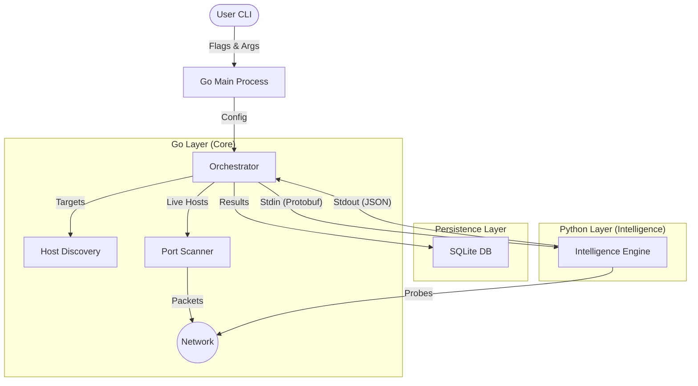

# 01. Architecture

### Responsibility
Defines the high-level structural components of Revealr and how they communicate.

### Why it exists
To provide a map of the system so developers know where new features belong.

### System Diagram

### Component Breakdown

1.  **Go Core (`cmd/`, `pkg/`)**
    -   **Responsibility:** CLI parsing, Concurrency management, Raw Socket handling, IPC orchestration.
    -   **Technology:** Go 1.23+, `cobra`, `gopacket`.

2.  **Intelligence Engine (`plugins/`)**
    -   **Responsibility:** Service version detection, OS fingerprinting, Vulnerability mapping.
    -   **Technology:** Python 3.10+.
    -   **Communication:** Receives `ScannedHost` data via **Stdin** (Protobuf encoded). Returns enriched data via **Stdout** (JSON).

3.  **Persistence (`data/db/`)**
    -   **Responsibility:** Storing scan results, configuration, and session state.
    -   **Technology:** SQLite (via `glebarez/go-sqlite` pure Go driver).

### Why Stdin/Stdout IPC?
We chose standard stream piping over gRPC/HTTP for the Go-Python bridge because:
-   **Simplicity:** No need to manage localhost ports or firewalls.
-   **Performance:** Zero network overhead.
-   **Lifecycle:** The Go process manages the Python subprocess lifecycle directly.

### Things you should not change lightly
-   **The IPC Protocol:** Changing the serialization format (Protobuf -> JSON or vice versa) affects both Go and Python codebases simultaneously.
-   **Database Driver:** We use a pure Go driver to ensure the binary remains portable without CGo dependence.
