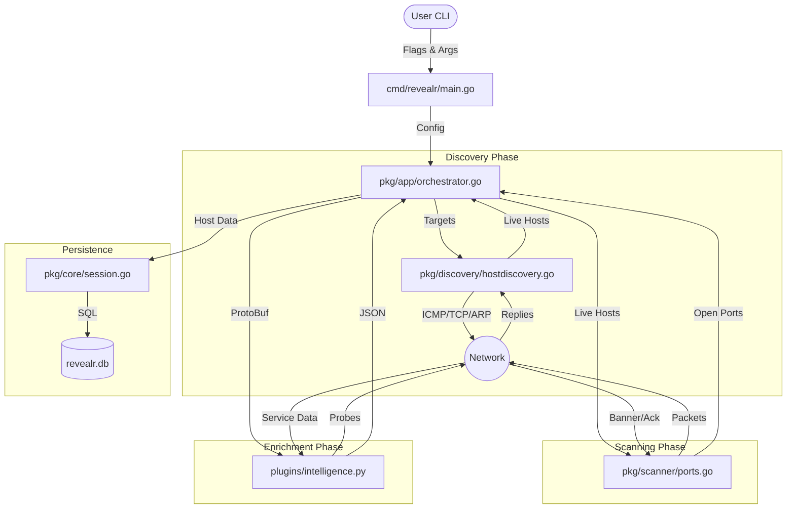

# Revealr Project Canvas

This document serves as a detailed architectural map (or "canvas") for the Revealr project. It outlines how files talk to each other, the flow of data, and the specific function calls involved in the scanning process.

## 1. High-Level Data Flow



## 2. Component Detail & Function Flow

### A. CLI Entry Point (`cmd/revealr/main.go`)
**Role:** Parses user input, initializes configuration, and kicks off the orchestration.

*   **Inputs:** CLI Flags (`--target`, `--ports`, `--mode`, `--config`).
*   **Outputs:** `config.ScanConfig` object.
*   **Key Function Flow:**
    *   `main()` calls `Execute()`
    *   `Execute()` runs `rootCmd.Execute()`
    *   `runScan()` (Cobra callback)
        *   -> Calls `config.LoadConfig()` to parse YAML/Flags.
        *   -> Calls `core.NewSession()` to open DB connection.
        *   -> Calls `app.NewOrchestrator(cfg, session)` to init logic.
        *   -> Calls `orchestrator.StartScan(targets)` to begin.

### B. The Orchestrator (`pkg/app/orchestrator.go`)
**Role:** The "Brain". Manages the lifecycle of the scan, coordinating discovery, scanning, and intelligence.

*   **Inputs:** List of Target strings (IPs/CIDRs).
*   **Outputs:** Console Logs, Final `Host` objects (saved to DB).
*   **Key Function Flow:**
    *   `StartScan(targets)`
        *   -> Calls `resolveTargets()`: Converts hostnames/CIDRs to IPs.
        *   -> **Discovery Step**:
            *   Calls `hostDisc.PingHosts()` (if method=icmp)
            *   OR `hostDisc.TCPProbeHosts()` (if method=tcp-probe)
            *   -> **Returns** list of `*core.Host` (Live hosts).
        *   -> **Scanning Step**:
            *   Iterates over Live Hosts.
            *   Calls `portScan.ScanPorts(ctx, host, portsToScan)`.
        *   -> **Enrichment Step**:
            *   Calls `o.callPythonIntelligence(ctx, host)`:
                *   Serializes `Host` to Protobuf.
                *   Executes `python plugins/intelligence.py`.
                *   Writes Protobuf to `stdin`.
                *   Reads JSON from `stdout`.
                *   Merges JSON result back into `Host`.
        *   -> **Persistence Step**:
            *   Calls `session.SaveHost(host)`.
        *   -> **Summary**:
            *   Calls `o.PrintScanSummary()`.

### C. Host Discovery (`pkg/discovery/hostdiscovery.go`)
**Role:** Identifies which IP addresses are active before scanning ports.

*   **Inputs:** List of `net.IP`.
*   **Outputs:** List of `*core.Host`.
*   **Key Functions:**
    *   `PingHosts()`:
        *   Opens ICMP listener (`icmp.ListenPacket`).
        *   Sends Echo Request.
        *   Waits for Echo Reply.
    *   `TCPProbeHosts()`:
        *   Tries `net.DialTimeout` on common ports (80, 443, 22).
        *   If connection succeeds or Refused (RST), host is UP.
    *   `ARPScan()`:
        *   Uses `pcap` to send ARP requests.
        *   Listens for ARP replies.

### D. Port Scanner (`pkg/scanner/ports.go`)
**Role:** Detects open ports on live hosts.

*   **Inputs:** `*core.Host`, List of Ports (int).
*   **Outputs:** Updates `*core.Host` with `Ports`.
*   **Key Functions:**
    *   `ScanPorts()`:
        *   Spins up worker pool (goroutines).
        *   Dispatches ports to workers.
    *   **Worker Logic**:
        *   If mode == `connect`: Calls `tcpConnectScan`.
            *   -> `net.DialTimeout`.
            *   -> If connected, `conn.Read` (Banner Grab).
        *   If mode == `syn` (Root): Calls `synScan`.
            *   -> `sendRawTCPAndListen` (Sends SYN).
            *   -> Parses response (SYN-ACK = Open, RST = Closed).

### E. Intelligence Engine (`plugins/intelligence.py`)
**Role:** Deep inspection of services.

*   **Inputs:** `ScanResultRequest` (Protobuf from Stdin).
*   **Outputs:** JSON Array (Updates for services).
*   **Key Functions/Flow:**
    *   `process_scan_result_script()` (Main Entry):
        *   Reads 4-byte length header.
        *   Reads Protobuf message.
        *   Parses into Python object.
    *   `identify_service_from_banner()`:
        *   Matches Regex patterns against raw banner.
    *   `probe_service_from_python()`:
        *   If banner unknown, opens socket (`socket` or `requests`).
        *   Sends probe (e.g., `GET /`, `HELP`).
        *   Returns detected Service Name & Version.

## 3. Data Structures (`pkg/core/types.go` & `revealr.proto`)

The system revolves around the **Host** object:

```go
type Host struct {
    ID        string            // IP Address
    IsUp      bool
    Ports     []*Port
    Details   map[string]string // OS, etc.
}

type Port struct {
    PortNumber int
    Protocol   string // "tcp", "udp"
    IsOpen     bool
    Service    *Service
}

type Service struct {
    Name    string // "http", "ssh"
    Version string // "2.4.49"
}
```

This object is passed from Orchestrator -> Scanner -> ProtoBuf -> Python -> Database.

## 4. File Interdependency Matrix

| File | Depends On (Imports/Calls) |
| :--- | :--- |
| `cmd/revealr/main.go` | `pkg/app`, `pkg/config`, `pkg/core`, `pkg/output` |
| `pkg/app/orchestrator.go` | `pkg/discovery`, `pkg/scanner`, `pkg/core`, `internal/proto` |
| `pkg/scanner/ports.go` | `pkg/core`, `internal/utils`, `gopacket` |
| `pkg/discovery/hostdiscovery.go` | `pkg/core`, `internal/utils`, `gopacket` |
| `plugins/intelligence.py` | `plugins/ipc/revealr_pb2.py` (Generated from Proto) |

## 5. Input/Output Summary

| Component | Input | Action | Output |
| :--- | :--- | :--- | :--- |
| **CLI** | `revealr scan -t 1.1.1.1 -p 80` | Configures scan | `ScanConfig` struct |
| **Orchestrator** | Target IPs | Coordinates | Final Console Report |
| **Scanner** | Host IP + Port List | Probes Network | Open Port List + Banners |
| **Python** | Host Info (Proto) | Analyzes/Probes | Enhanced Service Info (JSON) |
| **Database** | Host Object | SQL INSERT/UPDATE | `revealr.db` File |
